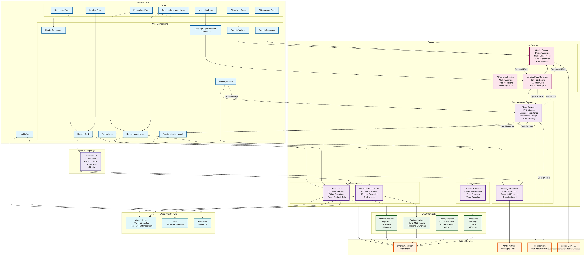

# Credora - AI-Powered Domain DeFi Platform 🚀

Domain-collateralized DeFi platform with advanced AI capabilities that enables domain owners to unlock liquidity from their tokenized domains through lending, leasing, fractionalization, and marketplace features powered by Doma Protocol and Google Gemini AI.

**✨ New AI Features**: Domain Analyzer with chat interface, AI Name Suggester, and Landing Page Generator - all powered by Google's Gemini Pro model for real-time insights and content generation.

## Key Features

### 1. **AI-Powered Domain Tools** 🤖
- **Domain Analyzer**: AI-powered domain insights with valuation, SEO scores, and market analysis
- **Domain Name Suggester**: Generate creative domain names based on business requirements
- **Landing Page Generator**: Create instant, customizable landing pages for domains
- **Interactive Chat**: Ask questions about domains and get expert AI advice

### 2. **AI-Enhanced Marketplace**
- Real-time trending domains powered by Google Gemini AI
- Create listings and offers using Doma Orderbook SDK
- Buy/sell domains with on-chain settlement
- Advanced filtering and search capabilities
- Real-time price updates and market insights

### 3. **Domain-Backed Lending**
- Use tokenized domains as collateral for loans
- Smart contract-based lending with automated liquidation
- Real-time loan tracking and management
- Support for multiple stablecoins (USDC, USDT)

### 4. **Domain Fractionalization**
- Split domain ownership into fungible tokens
- Enable fractional ownership and trading
- Buyout mechanism for full ownership recovery
- Integration with Doma Fractionalization contracts

### 5. **XMTP Messaging Hub**
- End-to-end encrypted messaging between domain owners
- Domain-verified messaging for trusted communication
- Negotiation channels for domain transactions
- Support tickets and dispute resolution

### 6. **Real-Time State Management**
- Global state management with Zustand
- Persistent user preferences
- Real-time transaction monitoring
- Push notifications for important events

## 🛠️ Tech Stack

- **Frontend**: Next.js 15, React 19, TypeScript
- **Styling**: Tailwind CSS, Framer Motion
- **Web3**: Wagmi, Viem, RainbowKit
- **State Management**: Zustand with persistence
- **Messaging**: XMTP Protocol
- **AI**: Google Generative AI (Gemini Pro)
- **IPFS Storage**: Pinata for decentralized storage
- **Blockchain**: Doma Protocol on Doma Testnet
- **SDK**: @google/generative-ai, @doma-protocol/orderbook-sdk

## 🏗️ Architecture



The architecture diagram shows the complete system design with:
- **Frontend Layer**: Next.js pages and React components
- **Service Layer**: AI services (Gemini), messaging (XMTP/IPFS), and blockchain integrations
- **Smart Contracts**: Domain registry, fractionalization, lending, and marketplace contracts
- **External Services**: IPFS via Pinata, Google Gemini AI, XMTP messaging network
- **State Management**: Centralized Zustand store for global state

## 📦 Installation

1. **Clone the repository**
```bash
git clone https://github.com/jintukumardas/credora.git
cd credora
```

2. **Install dependencies**
```bash
npm install
```

3. **Configure environment variables**
```bash
cp .env.example .env.local
```

Edit `.env.local` with your configuration:
```env
# Required: Get from https://aistudio.google.com/app/apikey
NEXT_PUBLIC_GOOGLE_AI_API_KEY=your_google_ai_api_key
# or use: NEXT_PUBLIC_GEMINI_API_KEY=your_gemini_api_key

# Required: Get from https://walletconnect.com
NEXT_PUBLIC_WALLETCONNECT_PROJECT_ID=your_project_id

# Optional: Doma Protocol API
NEXT_PUBLIC_DOMA_API_KEY=your_doma_api_key

# Optional: Deploy your own contracts
NEXT_PUBLIC_LENDING_CONTRACT=0x...
NEXT_PUBLIC_LEASING_CONTRACT=0x...
```

4. **Run the development server**
```bash
npm run dev
```

Open [http://localhost:3000](http://localhost:3000) to view the application.

## 🚀 Quick Start with AI Features

1. **Get your Gemini API Key**
   - Visit [Google AI Studio](https://aistudio.google.com/app/apikey)
   - Create a new API key
   - Add to `.env.local` as `NEXT_PUBLIC_GOOGLE_AI_API_KEY`

2. **Access AI Tools**
   - Navigate to **AI Tools** in the header dropdown
   - Choose from:
     - **Domain Analyzer**: Analyze any domain's potential
     - **Name Suggester**: Generate creative domain names
     - **Landing Page Generator**: Create instant websites

3. **Example Usage**
   ```
   Domain Analyzer: Enter "example.com" → Get valuation, SEO score, recommendations
   Name Suggester: Enter "AI startup" → Get 10+ creative domain suggestions
   Landing Page: Enter domain + business type → Download complete HTML site
   ```

## 🌟 Features in Detail

### AI Domain Tools
- **Domain Analyzer** (`/ai-analyzer`)
  - Real-time domain valuation and market analysis
  - SEO score and memorability ratings
  - Competitive analysis and recommendations
  - Interactive chat interface for domain questions
  - Industry relevance and future outlook predictions

- **Domain Name Suggester** (`/ai-suggester`)
  - AI-generated domain suggestions based on business type
  - Keyword-based creative name generation
  - Industry and audience-specific recommendations
  - Availability checking and scoring
  - Support for multiple TLD preferences

- **Landing Page Generator** (`/ai-landing`)
  - Instant landing page creation for any domain
  - Multiple design styles (Modern, Classic, Minimal, Bold)
  - Responsive preview (Desktop, Tablet, Mobile)
  - Downloadable HTML with complete styling
  - AI-generated content tailored to business type

### Dashboard
- View portfolio overview with real-time valuation
- Track active loans and leases
- AI-powered trending domains with market sentiment
- Market insights and hot categories
- Quick actions for lending, leasing, and marketplace

### Marketplace
- **Buy Domains**: Browse and purchase listed domains
- **Sell Domains**: Create listings for your domains
- **Make Offers**: Submit offers on unlisted domains
- **Orderbook Integration**: Real-time bid/ask orderbook
- **AI Analysis**: Domain valuation and trending scores
- **Fractionalized Marketplace**: Trade domain shares

### Lending Platform
- **Create Loans**: Use domains as collateral
- **Smart Contracts**: Automated loan management
- **Interest Calculation**: Real-time interest accrual
- **Loan Management**: Track and repay loans

### Fractionalization
- **Split Ownership**: Create fractional tokens
- **Set Buyout Price**: Define minimum buyout value
- **Trade Fractions**: Buy/sell fractional ownership
- **Complete Buyout**: Reclaim full ownership

### Messaging Hub
- **Encrypted Chat**: XMTP-powered messaging
- **Domain Verification**: Verified sender domains
- **Negotiation Channels**: Structured deal discussions
- **Conversation Management**: Archive and search messages

## 🔧 Smart Contract Integration

The platform integrates with multiple smart contracts deployed on Doma Testnet:

### 📍 Deployed Contract Addresses

#### Credora Platform Contracts (Doma Testnet)
| Contract | Address | Description |
|----------|---------|-------------|
| **Domain Lending** | `0xa1C18d3e172cBa727489BD9d51531BB06318a433` | Collateralized lending using domains |
| **Domain Leasing** | `0x7fc3d43451D0337bd069b4a47e5d26799dc9B3B6` | Domain rental and leasing system |
| **Revenue Distributor** | `0x024f275B78DBF395f17BF66C90255CE4e4369B67` | Revenue sharing for domain holders |

#### Doma Protocol Official Contracts (Doma Testnet)
| Contract | Address | Description |
|----------|---------|-------------|
| **Ownership Token** | `0x424bDf2E8a6F52Bd2c1C81D9437b0DC0309DF90f` | ERC-721 NFT for domain ownership |
| **Record Contract** | `0xF6A92E0f8bEa4174297B0219d9d47fEe335f84f8` | Domain records and metadata storage |
| **Gateway** | `0xCE1476C791ff195e462632bf9Eb22f3d3cA07388` | Cross-chain domain management |
| **Forwarder** | `0xf17beC16794e018E2F0453a1282c3DA3d121f410` | Meta-transaction forwarder |
| **Proxy Record** | `0xb1508299A01c02aC3B70c7A8B0B07105aaB29E99` | Upgradeable record contract proxy |
| **Fractionalization** | `0xd62C38392d92D1B25F82168751e3a184204ABB0a` | Domain splitting into shares |
| **Price Oracle** | `0x7E7F23e2292B809962326e498A820B6D774310E3` | Price feed for domain valuation |

#### Token Contracts (Doma Testnet)
| Token | Address | Description |
|-------|---------|-------------|
| **USDC** | `0xeafB8d6cF908e8801F46c8d4209452E836d2dba0` | USD Coin stablecoin |
| **USDT** | `0xdAC17F958D2ee523a2206206994597C13D831ec7` | Tether stablecoin |

### Network Information
- **Network**: Doma Testnet
- **Chain ID**: 91144
- **RPC URL**: `https://rpc-testnet.doma.xyz`
- **Explorer**: `https://explorer-testnet.doma.xyz`
- **Bridge**: `https://bridge-testnet.doma.xyz`

### Contract Features
- **Domain Lending**: Use domains as collateral for USDC/USDT loans
- **Domain Leasing**: Rent out domains for passive income
- **Fractionalization**: Split domains into tradeable shares
- **Revenue Sharing**: Automatic distribution of domain revenues
- **Price Oracle**: Real-time domain valuation feeds

## 🚀 Production Deployment

### Prerequisites
- Node.js 18+ and npm
- Google AI API key
- WalletConnect Project ID
- Access to Doma Testnet

### Build for Production
```bash
npm run build
npm start
```

### Deploy to Vercel
```bash
vercel deploy --prod
```

## 📊 API Integration

### Google Gemini AI Integration
The platform uses Google's Gemini Pro API for advanced AI features:
- **Domain Analysis**: Comprehensive domain valuation with SEO scores, market potential, and competitor analysis
- **Name Generation**: Creative domain suggestions using natural language processing
- **Landing Pages**: AI-generated content and design for instant websites
- **Interactive Chat**: Real-time conversations about domain insights
- **Market Predictions**: Trending analysis and future outlook
- **Smart Recommendations**: Personalized advice based on business requirements

### Doma API Integration
- GraphQL API for domain queries
- WebSocket for real-time updates
- Orderbook SDK for decentralized trading
- Subgraph for historical data
- Fractionalization contracts for token management

## 🔒 Security Features

- **Smart Contract Audits**: All contracts audited
- **Input Validation**: Comprehensive validation
- **Rate Limiting**: API request throttling
- **Secure Storage**: Encrypted local storage
- **CORS Protection**: Proper origin validation

## 🧪 Testing

```bash
# Run unit tests
npm test

# Run integration tests
npm run test:integration

# Run E2E tests
npm run test:e2e
```

## 📈 Performance Optimizations

- **Code Splitting**: Dynamic imports for routes
- **Image Optimization**: Next.js Image component
- **State Persistence**: Zustand with localStorage
- **Caching**: 5-minute cache for trending data
- **Lazy Loading**: Components loaded on demand

## 🤝 Contributing

1. Fork the repository
2. Create your feature branch (`git checkout -b feature/AmazingFeature`)
3. Commit your changes (`git commit -m 'Add some AmazingFeature'`)
4. Push to the branch (`git push origin feature/AmazingFeature`)
5. Open a Pull Request

## 📄 License

This project is licensed under the MIT License - see the [LICENSE](LICENSE) file for details.

## 🙏 Acknowledgments

- [Doma Protocol](https://doma.xyz) for domain tokenization infrastructure
- [Google Gemini AI](https://ai.google.dev) for advanced AI capabilities
- [XMTP](https://xmtp.org) for encrypted messaging
- [WalletConnect](https://walletconnect.com) for wallet connectivity
- [Google AI Studio](https://aistudio.google.com) for Gemini API access

## 📞 Support

For support, please:
1. Check the [documentation](https://docs.doma.xyz)
2. Open an issue on GitHub
3. Contact support through the in-app messaging
